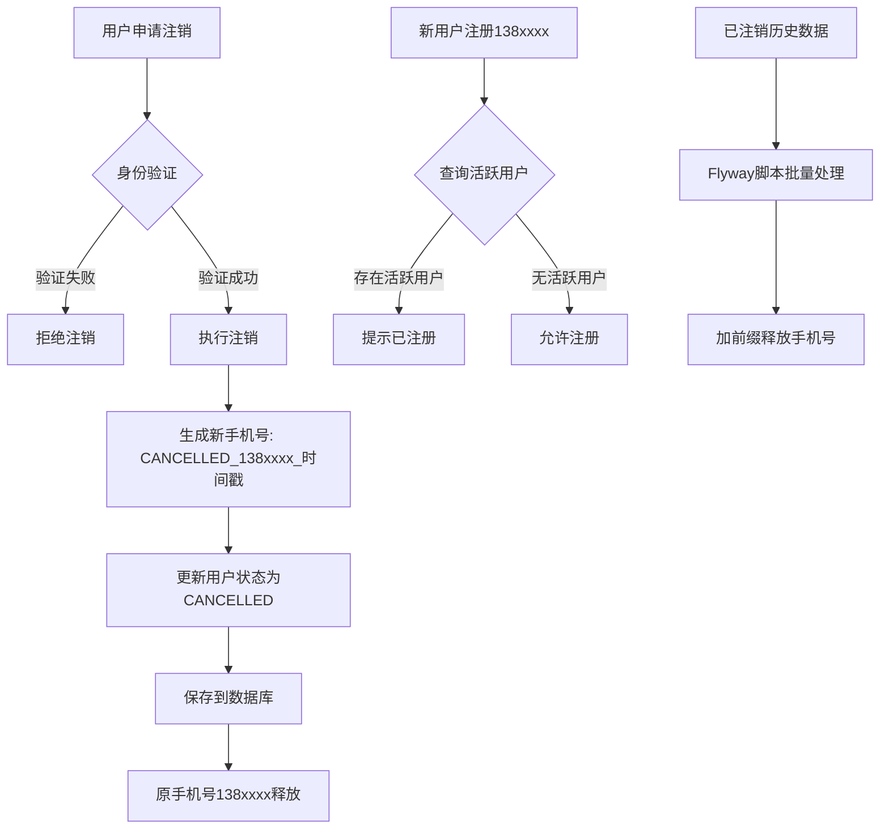

# 注销手机号释放功能 - 任务总结

## 概述

实现用户注销后释放手机号功能，允许注销后的手机号重新注册新账号。

## 问题背景

原有系统中，用户表对 `mobile` 字段有唯一索引约束，用户注销后（状态改为CANCELLED）手机号仍占用索引，导致该手机号无法再次注册。

## 解决方案（方案D）

注销时给手机号加前缀 `C_${原手机号}_${时间戳}`，释放唯一索引同时保留记录可追溯。
（前缀使用 `C_` 而非 `CANCELLED_` 以避免超过数据库字段长度限制）

## 变更清单

### 1. 代码变更

| 序号 | 文件路径 | 变更说明 |
|------|----------|----------|
| 1 | `csdn-meeting-domain/src/main/java/com/csdn/meeting/domain/entity/User.java` | 添加 `cancelWithMobilePrefix()` 方法 |
| 2 | `csdn-meeting-domain/src/main/java/com/csdn/meeting/domain/repository/UserRepository.java` | 添加 `findActiveByMobile()` 接口方法 |
| 3 | `csdn-meeting-infrastructure/src/main/java/com/csdn/meeting/infrastructure/repository/mapper/UserBaseMapper.java` | 添加 `selectActiveByMobile()` SQL查询 |
| 4 | `csdn-meeting-infrastructure/src/main/java/com/csdn/meeting/infrastructure/repository/impl/UserRepositoryImpl.java` | 实现 `findActiveByMobile()` 方法 |
| 5 | `csdn-meeting-domain/src/main/java/com/csdn/meeting/domain/service/UserDomainService.java` | 更新 `cancelUser()` 逻辑，添加 `findActiveUserByMobile()` 和 `isMobileActive()` 方法 |
| 6 | `csdn-meeting-application/src/main/java/com/csdn/meeting/application/service/UserAuthAppService.java` | 注册时改用 `isMobileActive()` 检查，CSDN扫码改用 `findActiveUserByMobile()` |
| 7 | `csdn-meeting-interfaces/src/main/java/com/csdn/meeting/interfaces/controller/UserProfileController.java` | 更新Swagger描述，说明注销后手机号可重新注册 |
| 8 | `csdn-meeting-interfaces/src/main/java/com/csdn/meeting/interfaces/controller/UserAuthController.java` | 更新Swagger描述，说明已注销手机号可重新注册 |

### 2. 数据库变更

**文件**: `csdn-meeting-start/src/main/resources/db/migration/V28__release_mobile_for_cancelled_users.sql`

```sql
-- 给所有已注销用户的手机号加前缀
UPDATE t_user
SET mobile = CONCAT('CANCELLED_', mobile, '_', UNIX_TIMESTAMP(COALESCE(update_time, create_time)) * 1000)
WHERE status = 2
  AND mobile NOT LIKE 'CANCELLED_%';
```

## 核心代码逻辑

### 注销时释放手机号

```java
public void cancelUser(String userId) {
    User user = userRepository.findByUserId(userId)
            .orElseThrow(() -> new IllegalArgumentException("用户不存在"));
    if (user.isCancelled()) {
        throw new IllegalArgumentException("账号已注销");
    }
    // 生成带前缀的手机号：C_13800138000_1712345678（使用短前缀避免超过字段长度）
    String prefixedMobile = "C_" + user.getMobile() + "_" + System.currentTimeMillis();
    user.cancelWithMobilePrefix(prefixedMobile);
    userRepository.save(user);
}
```

### 注册时只检查非注销用户

```java
// 原逻辑：检查所有用户
if (userDomainService.isMobileRegistered(command.getMobile())) {
    throw new IllegalArgumentException("该手机号已注册，请直接登录");
}

// 新逻辑：只检查非注销用户
if (userDomainService.isMobileActive(command.getMobile())) {
    throw new IllegalArgumentException("该手机号已注册，请直接登录");
}
```

## 数据流图



## 验收标准

- [x] 新注册用户可正常注销后再注册（同一手机号）
- [x] 历史已注销用户的手机号可被新用户注册
- [x] 正常用户（未注销）的手机号仍不可重复注册
- [x] 所有用户数据（包括已注销）在数据库中完整保留
- [x] 注册接口返回格式符合规范（code/data/msg）
- [x] Swagger文档已更新

## 注意事项

1. **历史数据**: 部署时需要执行Flyway脚本 `V28__release_mobile_for_cancelled_users.sql` 处理历史已注销用户
2. **手机号格式**: 注销后的手机号格式为 `CANCELLED_原手机号_时间戳毫秒`
3. **账号恢复**: 如需支持账号恢复功能，需额外开发逻辑（检查手机号是否被占用）

## 部署步骤

1. 部署代码变更
2. 执行Flyway数据库迁移（自动执行V28脚本）
3. 验证：注销一个测试账号，然后用同一手机号重新注册

---

**生成时间**: 2026-04-06
**版本**: v1.0
