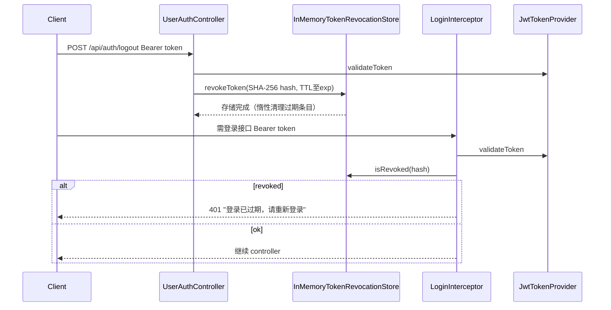

# JWT 登出 Token 撤销 - 实现总结

## 完成内容

按 [jwt-logout-revocation-plan.md](jwt-logout-revocation-plan.md) 方案 A 实现：登出后将当前 Token 加入黑名单，使其立即失效。

## 改动文件清单

| 文件 | 变更类型 | 说明 |
|------|----------|------|
| [TokenRevocationStore.java](../csdn-meeting-infrastructure/src/main/java/com/csdn/meeting/infrastructure/security/TokenRevocationStore.java) | 新增 | Token 撤销存储接口 |
| [InMemoryTokenRevocationStore.java](../csdn-meeting-infrastructure/src/main/java/com/csdn/meeting/infrastructure/security/InMemoryTokenRevocationStore.java) | 新增 | 内存实现，SHA-256 哈希存储，支持 TTL 自动清理 |
| [JwtTokenProvider.java](../csdn-meeting-infrastructure/src/main/java/com/csdn/meeting/infrastructure/security/JwtTokenProvider.java) | 修改 | 新增 `getExpirationTime()` / `getRemainingSeconds()` 供 TTL 计算 |
| [UserAuthController.java](../csdn-meeting-interfaces/src/main/java/com/csdn/meeting/interfaces/controller/UserAuthController.java) | 修改 | logout 提取 Bearer Token，校验通过后调用 `revokeToken()` |
| [LoginInterceptor.java](../csdn-meeting-interfaces/src/main/java/com/csdn/meeting/interfaces/config/LoginInterceptor.java) | 修改 | 注入 `TokenRevocationStore`，validate 后查 `isRevoked()` |
| [JwtHandshakeInterceptor.java](../csdn-meeting-interfaces/src/main/java/com/csdn/meeting/interfaces/interceptor/JwtHandshakeInterceptor.java) | 修改 | 同上，WebSocket 握手同样检查撤销 |

## 核心流程



## 关键实现细节

- **存储 key**: `SHA-256(token)` hex，避免存原始 JWT
- **TTL 策略**: 从 JWT `exp` 解析剩余秒数作为 Map 条目过期时间；解析失败则使用配置值兜底
- **内存清理**: 惰性清理（每次操作时扫描移除已过期条目），零额外线程
- **多实例**: 当前为单机内存实现；生产多实例时可替换为 Redis 实现（同一接口）
- **logout 无 Bearer**: 仍返回 200，仅在有有效 token 时写入撤销

## 验收测试要点

1. **登出后 Token 失效**: 登录获取 token A → logout 带 A → 再带 A 调用需登录接口 → 应返回 401
2. **未登出 Token 有效**: 登录获取 token A → 不调 logout → 带 A 调用需登录接口 → 应正常访问
3. **WebSocket 握手**: logout 后同一 token 的 WebSocket 握手应失败

## 编译验证

```bash
mvn clean compile -DskipTests
# Exit code: 0 (成功)
```

## 后续扩展建议

- **Redis 实现**: 当需要水平扩容时，实现 `TokenRevocationStore` 的 Redis 版本（`SETEX jwt:blacklist:<hash> 1 <ttl>`）
- **全端下线**: 若需要「用户一次登出踢掉所有设备」，可叠加方案 B（用户维度 token 版本号）
